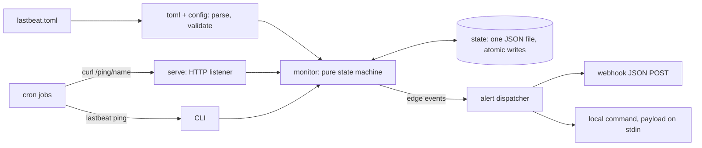

# lastbeat

[English](README.md) | [中文](README.zh.md) | [日本語](README.ja.md)

[](LICENSE) [](go.mod) [](CHANGELOG.md)  [](CONTRIBUTING.md)

**lastbeat：cron ジョブ向けのオープンソース「デッドマンスイッチ」モニター — ジョブは実行のたびに ping し、どれかが沈黙した瞬間に webhook で通知が届く。スケジュールは TOML に宣言、状態はすべて 1 つの JSON ファイル、依存ゼロ。**


```bash
git clone https://github.com/JaydenCJ/lastbeat && cd lastbeat
go build -o lastbeat ./cmd/lastbeat    # single static binary, stdlib only
```

> プレリリース：v0.1.0 はまだどのパッケージレジストリにも公開されていません。上記の通りソースからビルドしてください（Go ≥1.22 なら何でも可）。

## なぜ lastbeat？

cron の失敗は無音です。バックアップスクリプトが落ちた、更新ジョブのマシンが再起動後に起動していない、掃除タスクが誰かにコメントアウトされた — cron は教えてくれず、数週間後にそのバックアップが本当に必要になった時に初めて気付きます。解決策は古くからあるアイデア、デッドマンスイッチです：ジョブは成功のたびにモニターへ ping し、ping の*不在*こそが警報になります。しかし既存の実装は、望まないかもしれないインフラを前提にします：Healthchecks.io は優秀ですがホスト型で — セルフホストするなら Django、Postgres、SMTP リレーを動かすことになります。Cronitor や Dead Man's Snitch はモニター数課金の SaaS。手製の `find -mmin` スクリプトには猶予ウィンドウも復旧通知もなく、マシンが再起動すれば状態も消えます。lastbeat はこのアイデア全体を 1 つの静的バイナリに収めました：チェックは 1 つの TOML ファイルに宣言、ランタイム状態は `cat` できる原子書き込みの JSON ファイル 1 つに全バイト、通知は webhook かローカルコマンド — そして *cron の置き換えではありません*。ジョブは今の場所でそのまま動き続け、lastbeat はそのハートビートだけを見張ります。常駐プロセスすら不要です：cron から `lastbeat sweep` を回せば全チェックを評価して通知まで発火するので、モニター自体もただの cron の 1 行になります。

| | lastbeat | Healthchecks.io（セルフホスト） | Dead Man's Snitch / Cronitor | 手製スクリプト |
|---|---|---|---|---|
| デプロイの規模 | 静的バイナリ 1 つ | Django + Postgres + SMTP | なし（SaaS） | スクリプト 1 つ |
| データが自分のマシンに残る | ✅ | ✅ | ❌ | ✅ |
| 常駐プロセスなしでも動く | ✅ cron から `sweep` | ❌ | 対象外 | 部分的 |
| 猶予ウィンドウ + エッジ発火の通知 | ✅ | ✅ | ✅ | ❌ |
| 復旧イベント + 明示的失敗イベント | ✅ | ✅ | ✅ | ❌ |
| 設定がレビューできるテキストファイル | ✅ TOML | ❌ Web UI / API | ❌ Web UI | ✅ |
| ランタイム依存 | 0 | Python パッケージ約 30 個 | 対象外 | 0 |

<sub>依存数は 2026-07-13 に確認：lastbeat は Go 標準ライブラリのみを import。healthchecks プロジェクトの requirements.txt には直接/固定のパッケージが約 30 個、加えて Postgres が並びます。</sub>

## 特徴

- **どんなジョブのハートビートも見張る** — cron ランナーではありません：ジョブのスケジューリングは cron、systemd タイマー、CI、シェルループのまま。ジョブは終了時に URL を `curl` するか `lastbeat ping` を実行するだけ。
- **締切 + 猶予のステートマシン** — 各チェックは `interval`（「最低 24h ごとに ping」）と `grace`（「あと 45 分だけ待つ」）を宣言。状態は `waiting → up → late → down` と遷移し、通知は障害ごとに正確に 1 回だけ、繰り返しの爆撃はしません。
- **状態はファイル 1 つ** — lastbeat が覚えることはすべてバージョン付き JSON ドキュメント 1 つに収まり、書き込みは原子的（一時ファイル + rename）。バックアップも `cat` も自由、消せばリセット。
- **webhook とコマンド** — 通知はバージョン付き JSON を任意の URL に POST、またはローカルコマンドを実行：payload は stdin から渡り、argv の `{check}`/`{event}` プレースホルダーが展開されます。チャンネルごとにイベント購読とタイムアウトを設定可能。
- **デーモンレスも選べる** — `lastbeat sweep` は全チェックを 1 回評価して終了するので、cron の 1 行 `*/5 * * * * lastbeat sweep` だけで完全なモニターになります。`serve` モードならループバック HTTP リスナー（`/ping/<name>`、`/status`、任意の共有キー認証）が加わります。
- **明示的な失敗と復旧** — ジョブは `/ping/<name>/fail` で「実行したが壊れた」を報告でき、障害後の最初の成功 ping は `recovered` イベントを発火します。
- **依存ゼロ・テレメトリなし** — Go 標準ライブラリのみ、デフォルトで 127.0.0.1 にバインド。外向き通信はあなたが設定した webhook だけです。

## クイックスタート

```bash
lastbeat init                 # writes a starter lastbeat.toml
$EDITOR lastbeat.toml         # declare your checks
lastbeat ping nightly-backup  # what your cron jobs run after success
lastbeat sweep                # what detects the silence (cron this, or use serve)
lastbeat status
```

実際にキャプチャした出力 — `tmp-cleaner` ジョブ（interval `1h`、grace `10m`）の最終 ping が 02:00、sweep を 06:00 に実行：

```text
$ lastbeat sweep
sweep: tmp-cleaner is down (up -> down, overdue by 2h59m59s)

$ lastbeat status
lastbeat status — 3 checks @ 2026-07-13T06:00:00Z

  CHECK           STATUS    LAST PING             DUE
  nightly-backup  up        2026-07-13T02:00:01Z  in 20h0m1s
  tmp-cleaner     down      2026-07-13T02:00:01Z  overdue by 2h59m59s
  certs-renew     waiting   never                 —

1 check down
```

この `down` 遷移は購読中のすべての通知チャンネルへ次の payload を配送しました（実キャプチャ、1 行）：

```text
{"tool":"lastbeat","schema_version":1,"event":"down","check":"tmp-cleaner","status":"down","prev_status":"up","at":"2026-07-13T06:00:00Z","last_ping":"2026-07-13T02:00:01Z","overdue_seconds":10799,"interval":"1h0m0s","grace":"10m0s"}
```

serve モードでは、ジョブは代わりにループバック HTTP で報告します（[examples/crontab.example](examples/crontab.example) 参照）：

```bash
lastbeat serve &
curl -fsS http://127.0.0.1:8377/ping/nightly-backup
```

## 設定

完全なリファレンスは [docs/config.md](docs/config.md) に。内蔵パーサーが受け付ける TOML サブセットもそこに文書化されています。

| キー | デフォルト | 効果 |
|---|---|---|
| `[[check]].interval` | 必須 | チェックが期限超過と判定されるまでの最大の沈黙（`"90s"`、`"1h30m"`、`"1d"`、`"2w"`） |
| `[[check]].grace` | `[defaults].grace` か `"5m"` | 締切後、`down` 発火までの追加の猶予 |
| `[[check]].alerts` | 全通知チャンネル | このチェックを特定の `[[alert]]` チャンネルへルーティング |
| `[[alert]].url` / `command` | どちらか必須 | webhook JSON POST、またはローカル argv（payload は stdin から） |
| `[[alert]].events` | `["down", "failed", "recovered"]` | チャンネルが購読するイベント（`"late"` を追加可能） |
| `listen` | `"127.0.0.1:8377"` | serve モードのバインドアドレス。明示しない限りループバックのみ |
| `ping_key` | 未設定 | ping に必須の共有シークレット（`X-Lastbeat-Key` または `?key=`） |
| `state_file` | `"lastbeat.state.json"` | 全状態が入るその 1 ファイル。設定ファイルからの相対パス |

## CLI リファレンス

`lastbeat [-c FILE] <command>` — 終了コード：0 正常、1 `--fail-on-down` 該当、2 使い方エラー、3 実行時エラー。

| コマンド | 効果 |
|---|---|
| `init [PATH]` | スターター設定を書き出す（既存ファイルの上書きは拒否） |
| `serve` | HTTP リスナー + 周期 sweep；`/ping/<name>`、`/ping/<name>/fail`、`/status`、`/healthz` |
| `ping NAME [--note TEXT]` | ハートビートを状態ファイルへ直接記録 |
| `fail NAME [--note TEXT]` | ジョブの明示的な失敗を記録（`failed` を発火） |
| `sweep [--json]` | 全チェックを 1 回評価し、期限の来た通知を発火して終了 |
| `status [--format json] [--fail-on-down]` | 全チェックを表示；フラグ付きなら down があると終了コード 1 |
| `checks` | 設定済みのスケジュールと通知ルーティングを一覧 |

`LASTBEAT_NOW`（RFC3339）を設定すると `ping`/`fail`/`sweep`/`status` の時計が固定されます — 明日 03:00 の障害を今日リハーサルして、どの通知が飛ぶかを実際に確かめられます。

## 検証

このリポジトリは CI を同梱しません。上記の主張はすべてローカル実行で検証されます：

```bash
go test ./...            # 91 deterministic tests, offline, < 5 s
bash scripts/smoke.sh    # end-to-end CLI + HTTP check, prints SMOKE OK
```

## アーキテクチャ



## ロードマップ

- [x] v0.1.0 — 猶予ウィンドウ付き TOML チェック、エッジ発火の down/late/failed/recovered イベント、単一ファイルの原子的状態、webhook + コマンド通知、serve とデーモンレス sweep の両モード、91 テスト + smoke スクリプト
- [ ] 長引く障害への再通知（`renotify_every = "6h"`）
- [ ] `/ping/<name>/start` による実行時間トラッキングと `max_runtime` 上限
- [ ] interval に加えて cron 式スケジュール（`schedule = "15 2 * * *"`）
- [ ] serve モードに内蔵する極小の読み取り専用ステータスページ
- [ ] 不安定なネットワーク越しの取りこぼしを検出する連番付き ping

完全なリストは [open issues](https://github.com/JaydenCJ/lastbeat/issues) を参照。

## コントリビュート

issue・議論・PR を歓迎します — ローカルの作業フロー（フォーマット、vet、テスト、`SMOKE OK`）は [CONTRIBUTING.md](CONTRIBUTING.md) を参照。入門しやすいタスクは [good first issue](https://github.com/JaydenCJ/lastbeat/issues?q=is%3Aissue+is%3Aopen+label%3A%22good+first+issue%22) ラベル、設計の議論は [Discussions](https://github.com/JaydenCJ/lastbeat/discussions) で。

## ライセンス

[MIT](LICENSE)
