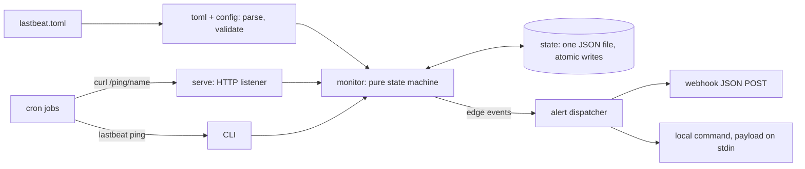

# lastbeat

[English](README.md) | [中文](README.zh.md) | [日本語](README.ja.md)

[](LICENSE) [](go.mod) [](CHANGELOG.md)  [](CONTRIBUTING.md)

**lastbeat：an open-source dead-man's-switch monitor for cron jobs — they ping after every run, you get a webhook the moment one goes silent. Schedules in TOML, all state in one JSON file, zero dependencies.**


```bash
git clone https://github.com/JaydenCJ/lastbeat && cd lastbeat
go build -o lastbeat ./cmd/lastbeat    # single static binary, stdlib only
```

> Pre-release: v0.1.0 is not tagged on a package registry yet; build from source as above (any Go ≥1.22).

## Why lastbeat?

Cron fails silently. A backup script that crashes, a renewal job on a machine that rebooted wrong, a cleanup task someone commented out — cron will not tell you, and you find out weeks later when you actually need the backup. The fix is an old idea, the dead-man's switch: the job pings a monitor after every successful run, and the *absence* of pings raises the alarm. But the existing implementations assume infrastructure you may not want: Healthchecks.io is excellent and hosted — self-hosting it means running Django, Postgres and an SMTP relay; Cronitor and Dead Man's Snitch are SaaS with per-monitor pricing; a hand-rolled `find -mmin` script has no grace windows, no recovery alerts, and no state when the machine reboots. lastbeat is the whole idea in one static binary: checks declared in a TOML file, every byte of runtime state in one atomic JSON file you can `cat`, alerts as webhooks or local commands — and it is *not a cron replacement*. Your jobs keep running wherever they run; lastbeat only watches their heartbeats. It even works with no daemon at all: `lastbeat sweep` from cron evaluates every check and fires alerts, so the monitor itself is just another cron line.

| | lastbeat | Healthchecks.io (self-hosted) | Dead Man's Snitch / Cronitor | hand-rolled script |
|---|---|---|---|---|
| Deploy footprint | 1 static binary | Django + Postgres + SMTP | none (SaaS) | 1 script |
| Your data stays on your box | ✅ | ✅ | ❌ | ✅ |
| Works with no long-lived daemon | ✅ `sweep` from cron | ❌ | n/a | partially |
| Grace windows + edge-triggered alerts | ✅ | ✅ | ✅ | ❌ |
| Recovery + explicit-failure events | ✅ | ✅ | ✅ | ❌ |
| Config is a reviewable text file | ✅ TOML | ❌ web UI / API | ❌ web UI | ✅ |
| Runtime dependencies | 0 | ~30 Python packages | n/a | 0 |

<sub>Dependency counts checked 2026-07-13: lastbeat imports the Go standard library only; the healthchecks project's requirements.txt lists ~30 direct/pinned packages plus Postgres.</sub>

## Features

- **Watches any job's heartbeat** — not a cron runner: whatever schedules your jobs (cron, systemd timers, CI, a shell loop) keeps doing so; jobs just `curl` a URL or run `lastbeat ping` when they finish.
- **Deadline + grace state machine** — each check declares `interval` ("must ping at least every 24h") and `grace` ("give it 45 more minutes"); statuses move `waiting → up → late → down` and alerts fire exactly once per outage, never repeatedly.
- **One file of state** — everything lastbeat remembers is a single versioned JSON document written atomically (temp file + rename); back it up, `cat` it, delete it to reset.
- **Webhooks and commands** — alerts POST versioned JSON to any URL, or exec a local command with the payload on stdin and `{check}`/`{event}` placeholders in argv; per-channel event subscriptions and timeouts.
- **Daemonless if you want** — `lastbeat sweep` evaluates every check once and exits, so a `*/5 * * * * lastbeat sweep` cron line is a complete monitor; `serve` mode adds a loopback HTTP listener with `/ping/<name>`, `/status` and optional shared-key auth.
- **Explicit failures and recoveries** — jobs can report "I ran and broke" via `/ping/<name>/fail`, and the first successful ping after an outage fires a `recovered` event.
- **Zero dependencies, no telemetry** — Go standard library only, binds 127.0.0.1 by default, and the only outbound traffic ever is the webhooks you configured.

## Quickstart

```bash
lastbeat init                 # writes a starter lastbeat.toml
$EDITOR lastbeat.toml         # declare your checks
lastbeat ping nightly-backup  # what your cron jobs run after success
lastbeat sweep                # what detects the silence (cron this, or use serve)
lastbeat status
```

Real captured output — a `tmp-cleaner` job (interval `1h`, grace `10m`) last pinged at 02:00, swept at 06:00:

```text
$ lastbeat sweep
sweep: tmp-cleaner is down (up -> down, overdue by 2h59m59s)

$ lastbeat status
lastbeat status — 3 checks @ 2026-07-13T06:00:00Z

  CHECK           STATUS    LAST PING             DUE
  nightly-backup  up        2026-07-13T02:00:01Z  in 20h0m1s
  tmp-cleaner     down      2026-07-13T02:00:01Z  overdue by 2h59m59s
  certs-renew     waiting   never                 —

1 check down
```

The `down` transition delivered this payload to every subscribed alert (real capture, one line):

```text
{"tool":"lastbeat","schema_version":1,"event":"down","check":"tmp-cleaner","status":"down","prev_status":"up","at":"2026-07-13T06:00:00Z","last_ping":"2026-07-13T02:00:01Z","overdue_seconds":10799,"interval":"1h0m0s","grace":"10m0s"}
```

In serve mode, jobs report over loopback HTTP instead (see [examples/crontab.example](examples/crontab.example)):

```bash
lastbeat serve &
curl -fsS http://127.0.0.1:8377/ping/nightly-backup
```

## Configuration

Full reference in [docs/config.md](docs/config.md); the TOML subset the built-in parser accepts is documented there too.

| Key | Default | Effect |
|---|---|---|
| `[[check]].interval` | required | maximum silence before the check is overdue (`"90s"`, `"1h30m"`, `"1d"`, `"2w"`) |
| `[[check]].grace` | `[defaults].grace` or `"5m"` | extra slack after the deadline before `down` fires |
| `[[check]].alerts` | all alerts | route this check to specific `[[alert]]` channels |
| `[[alert]].url` / `command` | one required | webhook JSON POST, or local argv with payload on stdin |
| `[[alert]].events` | `["down", "failed", "recovered"]` | subscribe a channel to specific events (add `"late"`) |
| `listen` | `"127.0.0.1:8377"` | serve-mode bind address; loopback unless you say otherwise |
| `ping_key` | unset | shared secret required on pings (`X-Lastbeat-Key` or `?key=`) |
| `state_file` | `"lastbeat.state.json"` | the one file all state lives in, relative to the config |

## CLI reference

`lastbeat [-c FILE] <command>` — exit codes: 0 ok, 1 `--fail-on-down` breach, 2 usage error, 3 runtime error.

| Command | Effect |
|---|---|
| `init [PATH]` | write a starter config (refuses to overwrite) |
| `serve` | HTTP listener + periodic sweep; `/ping/<name>`, `/ping/<name>/fail`, `/status`, `/healthz` |
| `ping NAME [--note TEXT]` | record a heartbeat directly in the state file |
| `fail NAME [--note TEXT]` | record an explicit job failure (fires `failed`) |
| `sweep [--json]` | evaluate all checks once, fire due alerts, exit |
| `status [--format json] [--fail-on-down]` | show every check; exit 1 if any is down (with the flag) |
| `checks` | list configured schedules and alert routing |

Setting `LASTBEAT_NOW` (RFC3339) freezes the clock for `ping`/`fail`/`sweep`/`status` — rehearse tomorrow's 03:00 outage today and watch the exact alerts fire.

## Verification

This repository ships no CI; every claim above is verified by local runs:

```bash
go test ./...            # 91 deterministic tests, offline, < 5 s
bash scripts/smoke.sh    # end-to-end CLI + HTTP check, prints SMOKE OK
```

## Architecture



## Roadmap

- [x] v0.1.0 — TOML checks with grace windows, edge-triggered down/late/failed/recovered events, single-file atomic state, webhook + command alerts, serve and daemonless sweep modes, 91 tests + smoke script
- [ ] Repeat reminders (`renotify_every = "6h"`) for long outages
- [ ] Run-duration tracking via `/ping/<name>/start` and a `max_runtime` limit
- [ ] Cron-expression schedules (`schedule = "15 2 * * *"`) alongside intervals
- [ ] Tiny read-only status page served from `serve` mode
- [ ] Sequence-numbered pings to detect lost heartbeats behind flaky networks

See the [open issues](https://github.com/JaydenCJ/lastbeat/issues) for the full list.

## Contributing

Issues, discussions and pull requests are welcome — see [CONTRIBUTING.md](CONTRIBUTING.md) for the local workflow (format, vet, tests, `SMOKE OK`). Good entry points are labelled [good first issue](https://github.com/JaydenCJ/lastbeat/issues?q=is%3Aissue+is%3Aopen+label%3A%22good+first+issue%22), and design questions live in [Discussions](https://github.com/JaydenCJ/lastbeat/discussions).

## License

[MIT](LICENSE)
