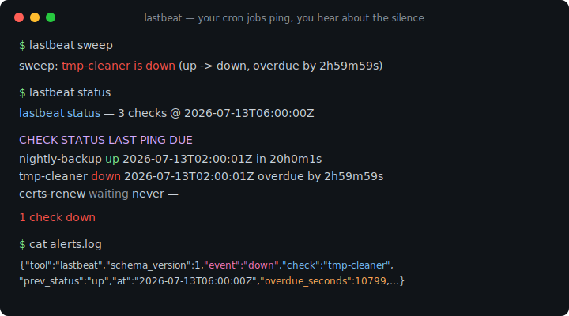
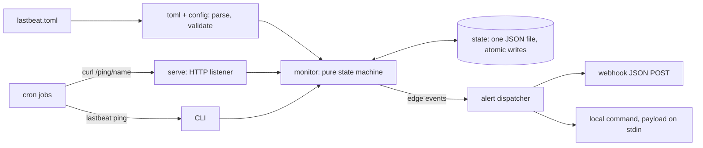

# lastbeat

[English](README.md) | [中文](README.zh.md) | [日本語](README.ja.md)

[](LICENSE) [](go.mod) [](CHANGELOG.md)  [](CONTRIBUTING.md)

**lastbeat：开源的 cron 任务"死人开关"监控器 — 任务每次运行后 ping 一下，一旦哪个突然沉默，你立刻收到 webhook 告警。调度声明在 TOML 里，全部状态存在一个 JSON 文件中，零依赖。**



```bash
git clone https://github.com/JaydenCJ/lastbeat && cd lastbeat
go build -o lastbeat ./cmd/lastbeat    # single static binary, stdlib only
```

> 预发布：v0.1.0 尚未发布到任何包仓库；请按上述方式从源码构建（任何 Go ≥1.22 均可）。

## 为什么选 lastbeat？

cron 的失败是无声的。备份脚本崩了、续期任务所在的机器重启后没起来、清理任务被人注释掉了 — cron 不会告诉你，几周后真正需要那份备份时你才发现。解法是一个古老的思路，即"死人开关"：任务每次成功运行后向监控器 ping 一下，而 ping 的*缺席*才是警报的来源。但现有实现都预设了你未必想要的基础设施：Healthchecks.io 很出色但是托管服务 — 自托管它意味着跑起 Django、Postgres 和 SMTP 中继；Cronitor 和 Dead Man's Snitch 是按监控项计费的 SaaS；手搓的 `find -mmin` 脚本没有宽限窗口、没有恢复告警、机器一重启状态全无。lastbeat 把整个思路装进一个静态二进制：检查项声明在一个 TOML 文件里，运行时状态的每个字节都在一个可以直接 `cat` 的原子写 JSON 文件中，告警走 webhook 或本地命令 — 而且它*不是 cron 的替代品*。你的任务照旧在原地运行；lastbeat 只看它们的心跳。它甚至完全不需要常驻进程：从 cron 里跑 `lastbeat sweep` 就能评估所有检查项并触发告警，监控器本身也只是又一行 cron。

| | lastbeat | Healthchecks.io（自托管） | Dead Man's Snitch / Cronitor | 手搓脚本 |
|---|---|---|---|---|
| 部署体积 | 1 个静态二进制 | Django + Postgres + SMTP | 无（SaaS） | 1 个脚本 |
| 数据留在自己机器上 | ✅ | ✅ | ❌ | ✅ |
| 无需常驻进程也能用 | ✅ 从 cron 跑 `sweep` | ❌ | 不适用 | 部分 |
| 宽限窗口 + 边沿触发告警 | ✅ | ✅ | ✅ | ❌ |
| 恢复事件 + 显式失败事件 | ✅ | ✅ | ✅ | ❌ |
| 配置是可 review 的文本文件 | ✅ TOML | ❌ Web UI / API | ❌ Web UI | ✅ |
| 运行时依赖 | 0 | 约 30 个 Python 包 | 不适用 | 0 |

<sub>依赖数量核对于 2026-07-13：lastbeat 只导入 Go 标准库；healthchecks 项目的 requirements.txt 列出约 30 个直接/锁定的包，外加 Postgres。</sub>

## 特性

- **监视任何任务的心跳** — 不是 cron 运行器：任务照旧由 cron、systemd timer、CI 或 shell 循环调度；它们只需在结束时 `curl` 一个 URL 或运行 `lastbeat ping`。
- **截止时间 + 宽限的状态机** — 每个检查项声明 `interval`（"至少每 24h ping 一次"）和 `grace`（"再多给它 45 分钟"）；状态沿 `waiting → up → late → down` 流转，每次故障告警只触发一次，绝不重复轰炸。
- **状态只有一个文件** — lastbeat 记住的一切都在一个带版本号的 JSON 文档里，写入是原子的（临时文件 + rename）；可以备份、可以 `cat`、删掉即重置。
- **Webhook 与命令** — 告警以带版本的 JSON POST 到任意 URL，或执行本地命令：payload 从 stdin 传入，argv 里的 `{check}`/`{event}` 占位符自动展开；每个通道有独立的事件订阅与超时。
- **想去掉守护进程也行** — `lastbeat sweep` 一次性评估所有检查项后退出，一行 `*/5 * * * * lastbeat sweep` 的 cron 就是完整的监控器；`serve` 模式则提供回环 HTTP 监听，含 `/ping/<name>`、`/status` 和可选的共享密钥鉴权。
- **显式失败与恢复** — 任务可以通过 `/ping/<name>/fail` 上报"我运行了但坏了"，故障后第一次成功 ping 会触发 `recovered` 事件。
- **零依赖、无遥测** — 仅 Go 标准库，默认绑定 127.0.0.1，唯一的对外流量就是你自己配置的 webhook。

## 快速上手

```bash
lastbeat init                 # writes a starter lastbeat.toml
$EDITOR lastbeat.toml         # declare your checks
lastbeat ping nightly-backup  # what your cron jobs run after success
lastbeat sweep                # what detects the silence (cron this, or use serve)
lastbeat status
```

真实抓取的输出 — `tmp-cleaner` 任务（interval `1h`、grace `10m`）最后一次 ping 在 02:00，06:00 执行 sweep：

```text
$ lastbeat sweep
sweep: tmp-cleaner is down (up -> down, overdue by 2h59m59s)

$ lastbeat status
lastbeat status — 3 checks @ 2026-07-13T06:00:00Z

  CHECK           STATUS    LAST PING             DUE
  nightly-backup  up        2026-07-13T02:00:01Z  in 20h0m1s
  tmp-cleaner     down      2026-07-13T02:00:01Z  overdue by 2h59m59s
  certs-renew     waiting   never                 —

1 check down
```

这次 `down` 转变向每个订阅的告警通道投递了如下 payload（真实抓取，单行）：

```text
{"tool":"lastbeat","schema_version":1,"event":"down","check":"tmp-cleaner","status":"down","prev_status":"up","at":"2026-07-13T06:00:00Z","last_ping":"2026-07-13T02:00:01Z","overdue_seconds":10799,"interval":"1h0m0s","grace":"10m0s"}
```

serve 模式下，任务改为通过回环 HTTP 上报（见 [examples/crontab.example](examples/crontab.example)）：

```bash
lastbeat serve &
curl -fsS http://127.0.0.1:8377/ping/nightly-backup
```

## 配置

完整参考见 [docs/config.md](docs/config.md)；内置解析器接受的 TOML 子集也在那里有文档。

| 键 | 默认值 | 作用 |
|---|---|---|
| `[[check]].interval` | 必填 | 检查项被判为超期前允许的最长沉默（`"90s"`、`"1h30m"`、`"1d"`、`"2w"`） |
| `[[check]].grace` | `[defaults].grace` 或 `"5m"` | 过了截止时间后、触发 `down` 前的额外宽限 |
| `[[check]].alerts` | 全部告警通道 | 把该检查项路由到指定的 `[[alert]]` 通道 |
| `[[alert]].url` / `command` | 二选一必填 | webhook JSON POST，或本地 argv、payload 从 stdin 传入 |
| `[[alert]].events` | `["down", "failed", "recovered"]` | 通道订阅哪些事件（可加 `"late"`） |
| `listen` | `"127.0.0.1:8377"` | serve 模式绑定地址；除非你明确指定，否则只绑回环 |
| `ping_key` | 未设置 | ping 必须携带的共享密钥（`X-Lastbeat-Key` 或 `?key=`） |
| `state_file` | `"lastbeat.state.json"` | 承载全部状态的那一个文件，相对配置文件解析 |

## CLI 参考

`lastbeat [-c FILE] <command>` — 退出码：0 正常，1 `--fail-on-down` 命中，2 用法错误，3 运行时错误。

| 命令 | 作用 |
|---|---|
| `init [PATH]` | 写出一份起步配置（拒绝覆盖已有文件） |
| `serve` | HTTP 监听 + 周期 sweep；`/ping/<name>`、`/ping/<name>/fail`、`/status`、`/healthz` |
| `ping NAME [--note TEXT]` | 直接把一次心跳写进状态文件 |
| `fail NAME [--note TEXT]` | 记录一次显式的任务失败（触发 `failed`） |
| `sweep [--json]` | 评估所有检查项一次，触发到期告警后退出 |
| `status [--format json] [--fail-on-down]` | 显示所有检查项；带该 flag 时有 down 即退出码 1 |
| `checks` | 列出已配置的调度与告警路由 |

设置 `LASTBEAT_NOW`（RFC3339）可为 `ping`/`fail`/`sweep`/`status` 冻结时钟 — 今天就能排练明天 03:00 的故障，亲眼看到会触发哪些告警。

## 验证

本仓库不带 CI；上面每一条声明都由本地运行验证：

```bash
go test ./...            # 91 deterministic tests, offline, < 5 s
bash scripts/smoke.sh    # end-to-end CLI + HTTP check, prints SMOKE OK
```

## 架构



## 路线图

- [x] v0.1.0 — 带宽限窗口的 TOML 检查项、边沿触发的 down/late/failed/recovered 事件、单文件原子状态、webhook + 命令告警、serve 与免守护 sweep 两种模式、91 个测试 + smoke 脚本
- [ ] 长时间故障的重复提醒（`renotify_every = "6h"`）
- [ ] 通过 `/ping/<name>/start` 追踪运行时长并支持 `max_runtime` 上限
- [ ] 在 interval 之外支持 cron 表达式调度（`schedule = "15 2 * * *"`）
- [ ] serve 模式内置一个极简只读状态页
- [ ] 带序号的 ping，以便在不稳定网络后面检测丢失的心跳

完整列表见 [open issues](https://github.com/JaydenCJ/lastbeat/issues)。

## 参与贡献

欢迎 issue、讨论与 PR — 本地工作流（格式化、vet、测试、`SMOKE OK`）见 [CONTRIBUTING.md](CONTRIBUTING.md)。入门任务见 [good first issue](https://github.com/JaydenCJ/lastbeat/issues?q=is%3Aissue+is%3Aopen+label%3A%22good+first+issue%22)，设计讨论在 [Discussions](https://github.com/JaydenCJ/lastbeat/discussions)。

## 许可证

[MIT](LICENSE)
